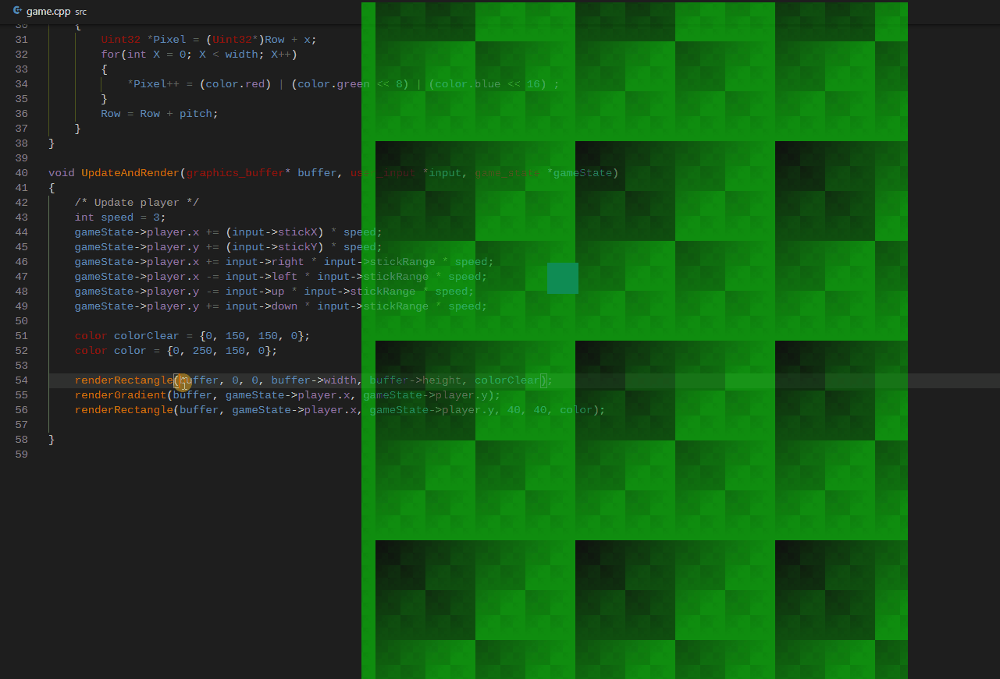

## Example:

## General Overview:
1. Split the code into 2 parts, platform layer and the game/application
2. Compile the game / application into a dll and export functions from it
3. Copy the dll to a different file(to prevent windows from locking the file) 
4. Load the dll from that different file at runtime and extract the functions
5. In a loop keep checking if the dll changed
   1. If it changed, null all the pointers to the previous dll
   2. Copy the dll to a different file
   3. Load the dll from that different file and extract the functions

## Notes:
 * Before copying temp dll to main dll make sure to NULL all the pointers that accessed something from the dll
 * Compile with /LD flag and also tell the compiler which functions to export with /link /EXPORT:function ... 
 * There are some additional troubles if you want to have hot reload while debugging with Visual Studio because VStudio is locking the PDB file so the solution is to write to a different file with a different name each time you build the dll

## Some other things in code
* Graphics buffer initialization, passing the buffer to dll to fill
* Input handling for a gamepad and keyboard, passing that to dll to update state
* Gamestate initializtion, passing that to dll
* Cool gradient/rectangle rendering in dll
* Locked framerate, delta time caluclations etc.

## Cool things that could be done
* Sound buffer initialization, passing the buffer to dll to fill
* Memory, passing that to dll to use and fill
* Looping application state

## To run:

* You need to run build.bat(from inside src folder) from developer prompt which you get in windows start menu when you install Visual Studio or Windows Build Tools